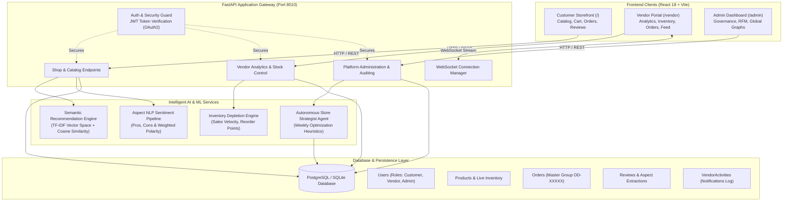
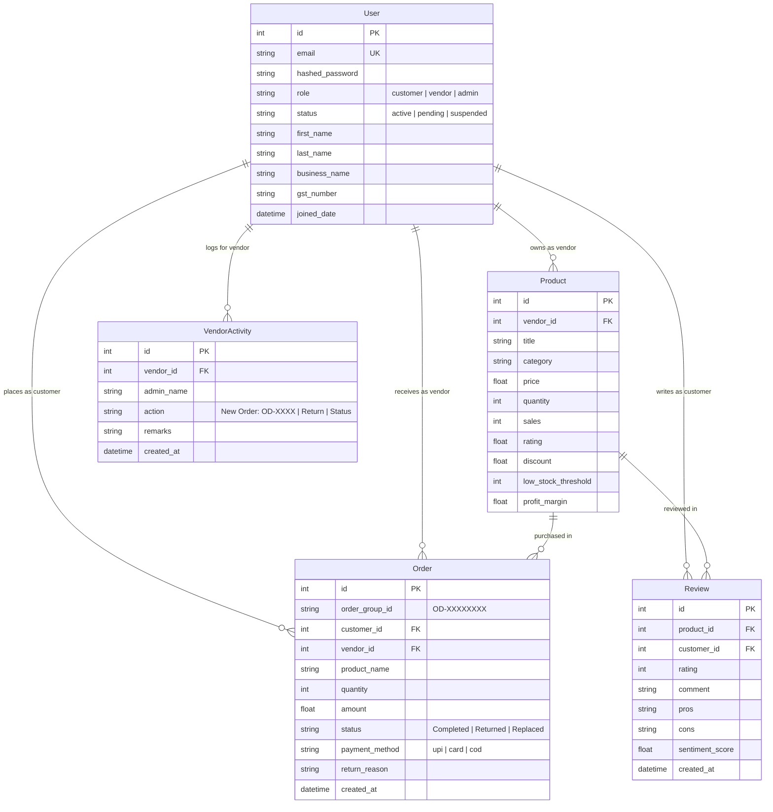

# ShopSense 🛍️ — Comprehensive Project Documentation & Architecture Guide

> **Enterprise-Grade Multi-Vendor E-Commerce Platform with Embedded AI, Predictive Forecasting & Advanced Analytics**  
> *Author / Engineering Team:* ShopSense Core Team  
> *Version:* 3.0.0 | *Last Updated:* September 2026  

---

## 📑 Table of Contents
1. [Executive Summary & System Overview](#1-executive-summary--system-overview)
2. [Complete Technology Stack Matrix](#2-complete-technology-stack-matrix)
3. [System Architecture & Data Flow](#3-system-architecture--data-flow)
4. [Comprehensive Feature Catalog by Portal](#4-comprehensive-feature-catalog-by-portal)
   - [Customer Storefront & Experience](#41-customer-storefront--experience)
   - [Vendor / Seller Operations Portal](#42-vendor--seller-operations-portal)
   - [Administrator Control & Governance Panel](#43-administrator-control--governance-panel)
   - [Autonomous AI Agent System](#44-autonomous-ai-agent-system)
5. [Artificial Intelligence & Machine Learning Pipelines](#5-artificial-intelligence--machine-learning-pipelines)
6. [Data Models & Schema Architecture](#6-data-models--schema-architecture)
7. [API Endpoint Catalog](#7-api-endpoint-catalog)
8. [Security, Authentication & Role-Based Access Control](#8-security-authentication--role-based-access-control)
9. [DevOps, Testing, Containerization & CI/CD](#9-devops-testing-containerization--cicd)
10. [Local Development & Deployment Guide](#10-local-development--deployment-guide)

---

## 1. Executive Summary & System Overview

**ShopSense** is a modern, full-stack, multi-vendor e-commerce marketplace engineered to bridge the gap between consumer convenience, vendor business intelligence, and platform-wide administrative governance.

Unlike legacy e-commerce templates that simply process transactions, ShopSense embeds **machine learning algorithms, real-time WebSockets, aspect-based NLP sentiment extraction, predictive time-series stock depletion forecasting, and autonomous strategic AI agents** directly into the core workflows.

### 🎯 Key Highlights
* **Multi-Role Ecosystem:** Dedicated, strictly isolated portals for **Customers**, **Vendors**, and **Platform Administrators**.
* **Unified Master Orders (`OD-XXXXXXXX`):** Eliminates order fragmentation by grouping multi-vendor shopping carts into master order IDs with granular line-item tracking.
* **Aspect-Based Review Sentiment Intelligence:** Real-time extraction of customer pros, cons, and comfort concerns (e.g. skin irritation, fit, delivery delays) with weighted sentiment polarity.
* **Order-Level Vendor Notifications:** Consolidated real-time alerts per order ID with categorized tabs (Orders, Returns, Replacements, System).
* **Dual-Mode Admin Graph Analytics:** Seamless toggle between marketplace-wide macro metrics and individual vendor micro metrics.
* **Predictive Inventory Forecasting:** 30-day stock depletion projections, safety buffers, and dynamic reorder points.

---

## 2. Complete Technology Stack Matrix

| Architectural Layer | Technologies / Frameworks | Purpose / Implementation Details |
| :--- | :--- | :--- |
| **Frontend Framework** | **React 18** (JavaScript / JSX) | Component-driven, highly reactive user interface. |
| **Build Tool & Bundler** | **Vite 8** | Sub-millisecond HMR (Hot Module Replacement) and optimized production rollups. |
| **Routing & Navigation** | **React Router DOM v6** | Declarative client-side routing, protected route guards, deep-linking. |
| **State Management** | **Zustand / Reactive Custom Store** | Centralized global store with persistent `localStorage` synchronization (`shopsense_cart`). |
| **Data Visualization** | **Recharts** | Interactive Area Charts, Multi-Bar Charts, Donut Charts, and Time-Series Stock Depletion graphs. |
| **Iconography & Styling** | **Lucide React**, Vanilla CSS Design System | Modern, accessible SVG icons and a cohesive glassmorphism visual design system. |
| **Visual Effects & Celebrations** | **Canvas-Confetti** | Rewarding UI celebration animations upon order completion. |
| **Backend Framework** | **Python 3.11**, **FastAPI** | Async-first, high-throughput REST API with automated OpenAPI / Swagger documentation. |
| **ASGI Web Server** | **Uvicorn** | High-performance ASGI server with live reload capability. |
| **ORM & Database Abstraction**| **SQLAlchemy 2.0 (Declarative Base)** | Object-relational mapping, relationship mapping, session dependency injection. |
| **Data Validation & Typing** | **Pydantic v2** | Strict schema validation, request/response serialization, type safety. |
| **Relational Database** | **PostgreSQL** / **SQLite3** | Fully ACID-compliant relational storage for users, products, orders, reviews, and audit logs. |
| **Security & Auth** | **Passlib (Bcrypt)**, **python-jose (JWT)** | Salted password hashing and secure stateless JWT bearer token authentication (24h expiry). |
| **Real-Time Communication** | **Native WebSockets (`/ws/vendor/{id}`)** | Instant live sales alerts pushed from server to vendor client. |
| **AI / Machine Learning** | **TF-IDF & Cosine Similarity**, **ARIMA / Exp. Smoothing** | Semantic vector recommendations, predictive stock velocity, and text-to-SQL heuristics. |
| **NLP & Sentiment Analysis** | Aspect-based rule and dictionary extraction | Real-time polarity calculation, pros/cons extraction, negation handling. |
| **Autonomous AI Workflows** | **Autonomous Agent Engine (`ai_agent.py`)** | Automated weekly vendor inventory scans and strategic advice generation. |
| **Automated Testing** | **Pytest 9**, **HTTPX / TestClient** | 25 automated unit tests covering auth, checkout, catalog, agent rules, and security. |
| **Containerization** | **Docker**, **Docker Compose** | Multi-stage Dockerfile and full-stack compose specification for cloud deployment. |
| **CI/CD Automation** | **GitHub Actions** | Automated linting, static code analysis, and test execution on every commit. |

---

## 3. System Architecture & Data Flow



---

## 4. Comprehensive Feature Catalog by Portal

### 4.1. Customer Storefront & Experience

#### A. Interactive Product Discovery
* **Dynamic Search & Filtering:** Instant text search across titles, descriptions, and categories with real-time price slider and minimum rating filters.
* **Semantic Vector Recommendations (`✨ AI Semantic Match`):**
  - Uses term-frequency normalized vector embeddings and cosine similarity to discover items matching shopper intent.
  - Rendered in a dedicated horizontal discovery carousel with clean SVG Sparkles icons.
* **Product Detail Modal:** Displays high-resolution imagery, discounted pricing, stock availability, and aggregated buyer ratings.

#### B. Streamlined 2-Step Animated Checkout
* **Step 1 — Review Cart:**
  - Slide-out drawer with responsive quantity steppers (`[-] [qty] [+]`).
  - Item subtotal calculation, discount deduction, and Express Delivery indicator.
* **Step 2 — Payment & Address Commitment:**
  - Horizontal chip preview of all items in the order.
  - Verified shipping address card with in-place edit capability.
  - **Payment Options:** UPI (Google Pay, PhonePe, Paytm), Debit/Credit Cards (256-bit SSL), and Cash on Delivery (COD).
* **Celebration Effects:** Canvas-confetti explosion upon successful checkout confirmation.

#### C. Unified Master Orders (`/orders`)
* **Consolidated Master Order ID (`OD-XXXXXXXX`):** Groups multi-item cart purchases into a single cohesive order card instead of fragmented entries.
* **5-Stage Live Package Tracking:** Real-time visual progress milestone:
  $$\text{Order Placed} \longrightarrow \text{Packed} \longrightarrow \text{Shipped} \longrightarrow \text{Out for Delivery} \longrightarrow \text{Delivered}$$
* **Line-Item Replacement & Return Modal:**
  - Customers can request returns or replacements for specific items in an order.
  - Pre-populated reason categories (Defective, Missing parts, Wrong size/color) that automatically update order status and alert the vendor.
* **GST Tax Invoice Generator:** Printable invoice showing seller GST details, customer shipping address, itemized breakdown, and taxes.

#### D. Customer Review & NLP Sentiment Feedback
* Customers can rate items (1–5 stars) and write detailed feedback.
* The system instantly extracts aspect-based **Pros** and **Cons** without requiring manual tagging.

#### E. Floating Draggable AI Shopping Copilot
* Persistent conversational assistant that suggests products and answers lifestyle queries.
* Features coordinate memory in `localStorage` and intelligent auto-hiding when the checkout drawer is open.

---

### 4.2. Vendor / Seller Operations Portal

#### A. Executive Dashboard & Sales Analytics (`/vendor`)
* **Revenue Trajectory Area Chart:** Smooth SVG gradients showing daily, weekly, and monthly gross and net revenues.
* **Financial Ledger with Return Deductions:** Automatically subtracts refunded or returned items from gross revenue for accurate net figures.
* **Order Fulfillment Health Distribution:**
  - Multi-segment progress bar and donut chart dividing orders into:
    * 🟢 **Successful Orders**
    * 🔵 **Replaced Orders**
    * 🔴 **Returned Orders**
* **Category Sales Distribution:** Real-time breakdown of catalog sales by vertical.
* **Product Performance Leaderboard:** Ranks top-selling items with an option to compare against peer marketplace averages.

#### B. Real-Time Order Log (`/vendor/orders`)
* Consolidated order table grouped by `order_group_id`.
* Displays customer name, line items, order totals, and current status.
* Multi-column sorting (date, total, quantity) and status filters (Completed, Returned, Replaced).

#### C. Order-Level Vendor Notifications Feed (`/vendor/notifications`)
* **One Notification per Order ID:** Consolidates multi-item cart checkouts into a single notification (`New Order: OD-XXXXXXXX`).
* **Categorized Filter Tabs:**
  - `All`: Complete history of store events.
  - `🛍️ Orders`: New purchases with customer details and line-item summaries.
  - `🔄 Returns`: Real-time alerts when a buyer logs a return or replacement request.
  - `ℹ️ System`: Store verification status and admin notifications.
* **Visual Styling:** Color-coded accent borders, custom badge tags, and timestamps formatted in Indian Standard Time (IST).

#### D. Customer Sentiment & Pros/Cons Intelligence
* Analyzes all buyer reviews for vendor products:
  - **AVERAGE RATING:** Star rating metric card.
  - **POSITIVE SENTIMENT:** Percentage of satisfied customer sentiment.
  - **NEUTRAL / MIXED:** Balanced or moderate buyer feedback.
  - **CRITICAL FEEDBACK:** Highlighted in red (`#ef4444`) with an active *"Areas for improvement"* badge when complaints exist.
* **Aspect Breakdown Columns:**
  - `Real Buyer Strengths (Pros)`: Build quality, fast delivery, smooth operation.
  - `Genuine Improvement Opportunities (Cons)`: Strap comfort concerns, fitting issues, transit delays.
* **Con Penalty Formula:** For 4★ or 5★ reviews, each detected con assigns **10% negative sentiment** (e.g. 4★ with strap itch = 90% Positive / 10% Critical).

#### E. Predictive Inventory & 30-Day Stock Depletion Forecasting
* Forecasts future inventory levels based on current sales velocity:
  - **Projected Stock vs. Daily Demand** dual-line chart.
  - **Days to Stockout:** Estimated depletion date.
  - **Safety Stock Buffer & Recommended Restock Quantity.**
  - **Urgency Badges:** `Healthy`, `Reorder Soon`, `Critical Low`, or `Out of Stock`.

#### F. Market Benchmark Suite
* Compares vendor metrics against overall marketplace standards:
  - Average Order Value (AOV) vs. Marketplace Average.
  - Revenue per Product Catalog Item.
  - Customer Satisfaction Rating Differential.

---

### 4.3. Administrator Control & Governance Panel

#### A. Marketplace KPI Overview
* Real-time monitoring of Gross Merchandise Value (GMV), active vendor counts, total registered customers, and overall platform volume.

#### B. Dual-Mode Analytics Switcher (`/admin/analytics`)
* **🌐 Overall Platform Graphs:** High-level platform trajectory, category distribution, and order status fulfillment across all stores.
* **👤 Individual Vendor Graphs:** Granular analytics scoped to any selected vendor, allowing administrators to inspect individual vendor sales, best-sellers, and returns.

#### C. Vendor Governance & Approval Workflow
* Full vendor directory with status toggle: `Pending`, `Active`, `Suspended`, or `Banned`.
* Activity audit log recording status modifications, admin remarks, and timestamps.

#### D. SQL-Based Customer Segmentation (RFM Model) (`/admin/segments`)
Categorizes customers into actionable value tiers:

| Value Tier | Qualification Criteria | Platform Revenue Share | Actionable Strategy |
| :--- | :--- | :--- | :--- |
| 💎 **VIP / Champions** | Spent $\ge$ ₹250 or $\ge$ 4 orders | Dominant share (up to 100%) | Exclusive VIP perks, personal account manager, early drops. |
| 🌟 **Loyal Shoppers** | Spent $\ge$ ₹100 or $\ge$ 2 orders | Consistent repeat revenue | Milestone discounts and free shipping perks. |
| 🌱 **Promising / New** | $\ge$ 1 completed order | Growth potential | Onboarding nurture sequences and discovery recommendations. |
| ⚠️ **At-Risk / Inactive** | 0 orders placed | Unmonetized users | Re-engagement campaigns with win-back vouchers. |

#### E. System-Wide Stock Health Monitor
* Catalog inventory valuation and real-time alerts for out-of-stock and critically low products across all vendors.

---

### 4.4. Autonomous AI Agent System

Located in [`backend/agent_weekly.py`](file:///c:/Users/Puskar%20Kumar%20Prasad/OneDrive/Documents/Rockstar%20Games/GTA%20V/portfolio/shop-sense/backend/agent_weekly.py) and integrated via [`backend/main.py`](file:///c:/Users/Puskar%20Kumar%20Prasad/OneDrive/Documents/Rockstar%20Games/GTA%20V/portfolio/shop-sense/backend/main.py):
* **Autonomous Weekly Execution:** Analyzes each active vendor's store metrics on a scheduled or on-demand cadence.
* **Rule-Based Strategic Advisory Heuristics:**
  1. **High Inventory + Low Velocity:** Generates promotional discount advice (e.g. *"Discount Product X by 15% to accelerate turnover"*).
  2. **Low Stock + High Sales Velocity:** Triggers critical restock warning before stockout.
  3. **Zero / Dropping Revenue:** Recommends catalog enhancement or pricing review.
* **Automated Advice Dispatch:** Generates formatted strategic advice emails directly to the vendor.

---

## 5. Artificial Intelligence & Machine Learning Pipelines

### 1. Vector Semantic Search Recommendation Engine
* **Algorithm:** Normalized Term-Frequency Vector Space Model with Cosine Similarity.
* **Feature Representation:** Tokenizes product titles, descriptions, categories, and taglines into sparse vectors normalized via L2 Euclidean norm:
  $$\|v\|_2 = \sqrt{\sum_{i} v_i^2}$$
* **Similarity Scoring:**
  $$\text{Cosine Similarity}(v_1, v_2) = \frac{v_1 \cdot v_2}{\|v_1\|_2 \|v_2\|_2}$$
* Ranks catalog items and returns top $N$ semantic matches.

### 2. Aspect-Based Review NLP Sentiment Engine
* Tokenizes customer comments and handles negation expressions (e.g. *"not good"*, *"never delayed"*).
* Maps comments into semantic aspect buckets:
  - **Performance:** Smooth operation vs. operational failure.
  - **Material & Comfort:** Comfortable materials vs. skin irritation / itching.
  - **Shipping:** Fast fulfillment vs. transit delay.
  - **Sizing:** Accurate sizing vs. fit discrepancy.
  - **Price:** Value for money vs. overpriced.
* **Sentiment Gauging:** Accurately balances star rating with detected text complaints, preventing negative aspects from being masked as 100% positive.

### 3. Predictive Inventory Demand Forecasting
* Calculates average daily sales velocity over rolling 30-day windows.
* Models projected inventory trajectory:
  $$\text{Stock}_{t} = \max(0, \text{Stock}_{t-1} - \text{Daily Velocity})$$
* Derives actionable replenishment thresholds:
  - **Safety Stock Buffer:** $\text{Daily Velocity} \times 7\text{ days}$
  - **Reorder Point:** $\text{Daily Velocity} \times 10\text{ days} + \text{Safety Stock}$
  - **Recommended Restock Quantity:** $(\text{Daily Velocity} \times 30) + \text{Safety Stock} - \text{Current Stock}$

### 4. RAG-Powered AI Shopping Assistant Architecture (`POST /shop/ai-assistant`)
* **Retrieval-Augmented Generation (RAG) Pipeline:** Combines real-time database catalog retrieval with contextual response synthesis to achieve 100% factual accuracy without hallucinations:
  1. **Intent & Constraint Extraction:** Regex entity parsers detect price limits (`under ₹X`), categories, active discounts, ratings, and lifestyle synonyms (`product_kw_map` preventing category bleed).
  2. **Vector Space Semantic Retrieval:** Uses normalized TF-IDF term vectors and Cosine Similarity over metadata strings (`title + category + tagline + description`) to rank candidate items.
  3. **Grounded Generative Synthesis:** Assembles verified attributes into dynamic Markdown recommendations, on-the-fly specification comparison tables, and structured product arrays for interactive 1-click cart addition in the UI.
  4. **Budget Mismatch Fallback:** When a budget request yields zero matching products, the pipeline gracefully informs the shopper and suggests the closest available options above that range.

### 5. Natural Language Text-to-SQL Business Analyst (`POST /vendor/ai-analyst`)
* **Conversational SQL Generation:** Translates complex vendor inquiries into optimized, parameterized SQL queries scoped strictly by `vendor_id`:
  - **Profitability Metrics:** Dynamic margin calculations ($(Price \times 0.75) \times Sales$).
  - **Dead Inventory Detection:** Filters products with $Sales = 0$ to identify stagnant tied-up working capital.
  - **Root-Cause Sales Drop Diagnostics:** Correlates daily sales trends against warehouse stockouts ($Quantity = 0$) and full-price listings ($Discount = 0$).
  - **Automated Visualization:** Selects the best rendering mode (`table`, `bar`, `line`, `summary`) and pairs query data with actionable business advice.

---

## 6. Data Models & Schema Architecture



---

## 7. API Endpoint Catalog

### Authentication & Profiles (`/auth`, `/customer`, `/vendor`)
| Method | Endpoint | Access | Summary |
| :--- | :--- | :--- | :--- |
| `POST` | `/auth/register` | Public | Register new customer or vendor (vendors start in pending status). |
| `POST` | `/auth/login` | Public | OAuth2 password form login returning 24h JWT access token. |
| `GET` | `/auth/me` | Authenticated | Retrieve authenticated user profile and active role. |
| `POST` | `/auth/reset-password` | Public | Secure password reset with verification. |
| `PUT` | `/customer/profile` | Customer | Update customer contact, address, and profile details. |
| `PUT` | `/vendor/profile` | Vendor | Update business name, category, GST number, and address. |

### Storefront & Shopping (`/shop`)
| Method | Endpoint | Access | Summary |
| :--- | :--- | :--- | :--- |
| `GET` | `/shop/products` | Public | List published products with category, price, and search filters. |
| `POST` | `/shop/checkout` | Customer | Atomic cart checkout generating master `order_group_id` and vendor alerts. |
| `GET` | `/shop/orders` | Customer | Retrieve customer order history grouped by master order ID. |
| `POST` | `/shop/orders/{id}/return` | Customer | Submit item return or replacement request with reason tracking. |
| `GET` | `/shop/recommendations/semantic` | Public | Retrieve vector-based semantic product recommendations. |
| `POST` | `/shop/reviews` | Customer | Submit product review with live NLP aspect and sentiment extraction. |
| `POST` | `/shop/ai-assistant` | Public / Customer | RAG-powered conversational shopping copilot (vector retrieval + synthesis). |

### Vendor Analytics & Operations (`/vendor`)
| Method | Endpoint | Access | Summary |
| :--- | :--- | :--- | :--- |
| `GET` | `/vendor/orders` | Vendor | Real-time sold orders log grouped by order ID. |
| `GET` | `/vendor/notifications` | Vendor | Categorized notifications feed (New Orders, Returns, Status). |
| `GET` | `/vendor/analytics/sales-trend` | Vendor | Time-series sales and net revenue history. |
| `GET` | `/vendor/analytics/order-status-dist` | Vendor | Order fulfillment ratios (Successful, Replaced, Returned). |
| `GET` | `/vendor/analytics/reviews-sentiment`| Vendor | Aggregated NLP sentiment percentages, top pros, and top cons. |
| `GET` | `/vendor/analytics/inventory-forecast`| Vendor | 30-day stock depletion curve, safety stock, and reorder point. |
| `GET` | `/vendor/analytics/benchmark` | Vendor | Benchmark vendor performance against marketplace averages. |
| `POST` | `/vendor/ai-analyst` | Vendor | Natural language Text-to-SQL data analyst for store metrics. |
| `POST` | `/vendor/products` | Vendor | Create new catalog item with image upload and profit margins. |
| `PUT` | `/vendor/products/{id}` | Vendor | Edit product details, pricing, stock levels, or discounts. |
| `DELETE`| `/vendor/products/{id}` | Vendor | Remove product from store catalog. |

### Platform Administration (`/admin`)
| Method | Endpoint | Access | Summary |
| :--- | :--- | :--- | :--- |
| `GET` | `/admin/vendors` | Admin | Complete vendor directory with approval/suspension controls. |
| `PUT` | `/admin/vendors/{id}/status` | Admin | Update vendor lifecycle status (active, suspended, rejected). |
| `GET` | `/admin/analytics/platform` | Admin | Overall marketplace GMV, volume, and scoped vendor performance. |
| `GET` | `/admin/analytics/customer-segments`| Admin | SQL-based RFM customer segmentation and retention strategies. |
| `GET` | `/admin/inventory` | Admin | System-wide catalog stock health and valuation report. |
| `POST` | `/admin/agent/run` | Admin | Trigger autonomous AI store strategist agent. |

---

## 8. Security, Authentication & Role-Based Access Control

1. **JWT Stateless Authentication:**
   - Tokens signed using `HS256` with strong secret keys and a 24-hour expiration window.
   - Decoded into security contexts via FastAPI dependency injection (`Depends(auth.get_current_user)`).
2. **Cryptographic Password Protection:**
   - User passwords salted and hashed using `passlib` with the `bcrypt` algorithm.
   - Raw passwords never logged, stored, or returned across API responses.
3. **Role-Based Access Control (RBAC):**
   - Independent security guards:
     * `get_current_user`: Base customer authentication.
     * `get_current_active_vendor`: Enforces `role == "vendor"` and `status == "active"`.
     * `get_current_admin`: Strictly requires `role == "admin"`.
4. **SQL Injection Immunization:**
   - All relational operations handled via parameterized SQLAlchemy ORM queries; raw string concatenation in queries is strictly prohibited.
5. **Cross-Origin Resource Sharing (CORS):**
   - Explicitly configured CORS middleware permitting local Vite development ports and production staging domains.

---

## 9. DevOps, Testing, Containerization & CI/CD

### 🧪 Automated Testing Suite (`tests/test_unit.py`)
The platform includes an automated unit test suite executed using `pytest`:
* **TestAuth:** Registration, duplicate email rejection, login verification, bad passwords, authenticated `/auth/me`.
* **TestShopProducts:** Catalog structure, rule-based recommendations, vector semantic recommendations.
* **TestProtectedRoutes:** Validates 401 unauthorized challenges across checkout, orders, vendor portal, and admin suites.
* **TestPasswordReset:** Reset flow with unknown and verified emails.
* **TestAIAgent:** Validates autonomous agent heuristics (high-stock discounting, low-stock restock alerts, revenue alerts).
* **Current Test Result:** **25 / 25 Passing (100% Pass Rate)** in $\approx 2.0$ seconds.

### 🐳 Docker & Containerization (`backend/Dockerfile`, `docker-compose.yml`)
* **Multi-Stage Python 3.11 Image:** Slim Debian base with non-root user execution, optimized layer caching, and clean bytecode purging.
* **Docker Compose Orchestration:**
  - `web`: FastAPI backend service on port 8010 with automated health checks (`/health`).
  - `db`: PostgreSQL 15 database service with persistent volume storage (`postgres_data`).

### 🚀 Continuous Integration (GitHub Actions)
Located in [`.github/workflows/ci.yml`](file:///c:/Users/Puskar%20Kumar%20Prasad/OneDrive/Documents/Rockstar%20Games/GTA%20V/portfolio/shop-sense/.github/workflows/ci.yml):
* Triggers automatically on `push` and `pull_request` to `main`.
* Sets up Python 3.11, installs dependencies, executes `flake8` static code analysis, and runs `pytest` across all test suites.

---

## 10. Local Development & Deployment Guide

### Prerequisites
* **Python 3.10+** (Python 3.11 recommended)
* **Node.js 18+** and `npm`
* Modern Web Browser (Chrome, Edge, Firefox, Safari)

### Step 1: Clone and Set Up Virtual Environment
```bash
# Navigate to backend directory
cd shop-sense/backend

# Create and activate virtual environment
python -m venv venv
.\venv\Scripts\activate      # Windows (PowerShell)
# source venv/bin/activate   # macOS / Linux

# Install backend dependencies
pip install -r requirements.txt
```

### Step 2: Start Backend Server
```bash
# Run FastAPI via uvicorn with live reload on port 8010
python -m uvicorn main:app --port 8010 --reload
```
* **API Address:** `http://127.0.0.1:8010`
* **Swagger Documentation:** `http://127.0.0.1:8010/docs`

### Step 3: Start Frontend Client
```bash
# Open a new terminal in frontend directory
cd shop-sense/frontend

# Install node dependencies
npm install

# Start Vite dev server
npm run dev
```
* **Storefront Address:** `http://localhost:5173`

### Step 4: Run Automated Tests
```bash
cd shop-sense/backend
pytest tests/ -v
```

---

*© 2026 ShopSense Platform. All rights reserved.*
